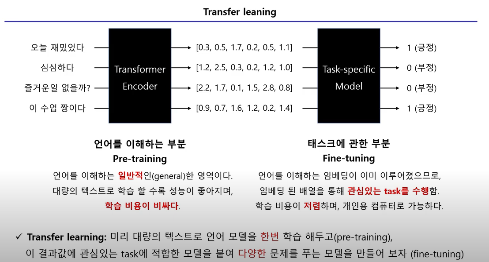
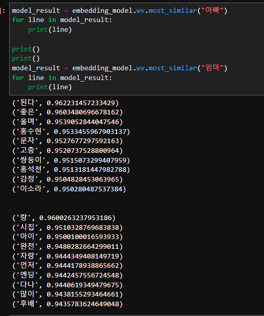
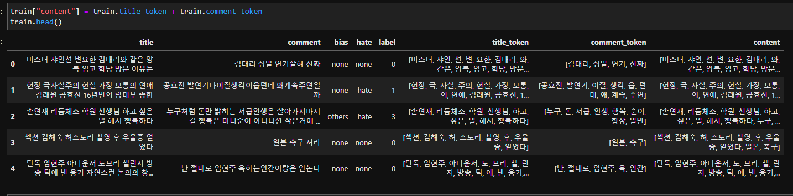
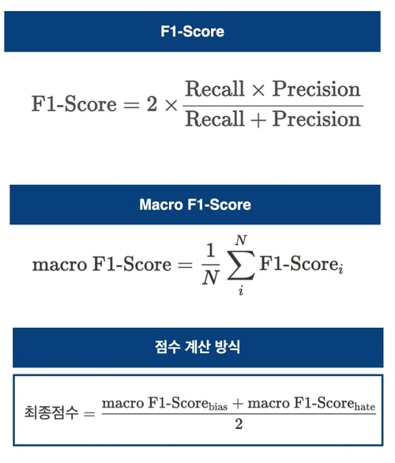

# 1일차


## 이번에는 NLP대회를 시작하면서 공부한 내용들을 정리해보겠습니다.

- 전체적인 흐름 
  - 대회의 목적은 댓글을 분류하는것이므로, 댓글들로만 학습된 모델들을 사용하는것이 좋아보입니다.
  - 최종적으로 결과물은 class별로 구분하는것이므로, fine tuning을 해야합니다.
  - 전처리에대한 고민을 해야합니다.!!
<br/><br/><br/>

## Reference
<ul>
<li><a href="https://bigwaveai.tistory.com/1?category=953606" target="_blank">https://bigwaveai.tistory.com/1?category=953606</a></li>
<li><a href="https://complexoftaste.tistory.com/2" target="_blank">https://complexoftaste.tistory.com/2</a></li>
<li><a href="https://drive.google.com/file/d/1EkymGGy-6Fzh-DobbplbZcMThG9TP58P/view" target="_blank">https://drive.google.com/file/d/1EkymGGy-6Fzh-DobbplbZcMThG9TP58P/view</a></li>
<li><a href="https://github.com/Seolini/KoBERT_Korean_multi_classification/blob/main/KoBERT_%ED%95%9C%EA%B5%AD%EC%96%B4_7%EA%B0%9C%EA%B0%90%EC%A0%95_%EB%8B%A4%EC%A4%91%EB%B6%84%EB%A5%98.ipynb" target="_blank">https://github.com/Seolini/KoBERT_Korean_multi_classification/blob/main/KoBERT_%ED%95%9C%EA%B5%AD%EC%96%B4_7%EA%B0%9C%EA%B0%90%EC%A0%95_%EB%8B%A4%EC%A4%91%EB%B6%84%EB%A5%98.ipynb</a></li>
<li><a href="https://drive.google.com/file/d/1EkymGGy-6Fzh-DobbplbZcMThG9TP58P/view" target="_blank">https://drive.google.com/file/d/1EkymGGy-6Fzh-DobbplbZcMThG9TP58P/view</a></li>
<li><a href="https://moondol-ai.tistory.com/241" target="_blank">https://moondol-ai.tistory.com/241</a></li>
<li><a href="https://www.youtube.com/watch?v=f-86-HcYYi8" target="_blank">https://www.youtube.com/watch?v=f-86-HcYYi8</a></li>


</ul>
<br/><br/><br/>


## 데이터 전처리
```python
print(len(train_data))

# 한글과 공백 제외하고 전체 다 제거.
train_data['document'] = train_data['document'].str.replace("[^ㄱ-ㅎㅏ-ㅣ가-힣 ]","")

# 만약 한글이 없는 댓글이 있다면, null값으로 변경한후,null값이 몇개인지 확인해본다.
train_data['comment'] = train_data['comment'].str.replace('^ +', "") # white space 데이터를 empty value로 변경
train_data['comment'].replace('', np.nan, inplace=True)
print(train_data.isnull().sum())

# null값이 있는데이터를 삭제해준다.
train_data = train_data.dropna(how = 'any')
print(len(train_data))

```


# 2일차

## Annotation Guide 를 보고있는데, 애매한 경우 주관적인 경우에의해 판단하라고 Guide도 적어놨다.
여기서 확신했다. 정확성은 크게 높일수가 없겠구나..

- <a href="https://www.notion.so/c1ecb7cc52d446cc93d928d172ef8442" target="_blank">Annotation Guide</a>

이러면 train data의 label을 전부 다 확인해 봐야 한다.
<br/><br/>

# 3일차
NLP란,<br/>
우리가 흔히들 자연어 과제(Task)를 진행할 때, pre-trained model을 사용하는데, 사용하는 이유는, 컴퓨터 자원을 너무 많이 소비하기 때문이다.
pre-trained을 하게되면, 문맥의 의미를 학습하게 되고, 사람처럼(이정도 까지는 아직 아니지만)학습을 한다.<br/><br/>
그런다음 fine-tuning이라는 걸 하게되는데, 정말 많은 용량의 글들을 수집해서, 학습해도 상관없지만, 시간이 오래 걸리고, 컴퓨터 자원을 많이 소비하게 되므로, Task에 맞게 학습을 진행해준다.
<br/><br/>


위의 이미지를 가져온 곳이며 개인적으로 생각했을때 설명이 잘 되어있는 유튜브 링크를 첨부하겠습니다.<br/>
<a href="https://www.youtube.com/watch?v=Z201jwWo-xs&list=PLrLEKGJAgXxL-R9IqDH7HANWXRsS900tF" target="_blank">링크</a>


개인적으로 하는말....<br/>
와..이게 인공지능의 3가지 주요분야인 computer vision, time series, nlp를 쉬지않고 대회를 하니깐, 공부할때랑은 확실히 다르게 습득하는게 차원이 다르다...<br/>
역시 나는 실전에 부딪치면서 배우는 스타일이다..<br/>


<br/><br/><br/>

# 4일차
와... 단어들을 관계유사도부터 시작해서 정말 안해본게 없을정도이다..<br/>
사실 huggingface에 있는 beomi분의 bias, hate 모델들을 가져와서 쓰면 정말 편하고 좋지만, 학습시키려니 막막한 부분들이 너무 많다....<br/>
편한 길을 가야했는데 ㅋㅋㅋ<br/>

<a href="https://super.gluebenchmark.com/leaderboard" target="_blank">https://super.gluebenchmark.com/leaderboard</a>

위의 링크는 nlp의 성능을 확인해주는 지표를 모아둔 사이트이다.<br/>
nlp에서의 task라고 하면, 단어생성, 분류, Q/A(?)뭐 이런게 있다.<br/>
인공지능을 하다보면 아무래도 치팅이냐 아니냐가 중요해지는데,<br/>
학습시킨 데이터로 평가하면 문제가 되니, 위의 사이트에서는 특정 데이터셋을 가지고 평가를 해주는것 같다.<br/>
사이트에 들어가보면 BERT모델은 거의 최하단에 rank되어 있다..ㅜㅜ<br/>
작업내역 정리하는것도 일이지만,, 너무 많이 해서 머리가 터질지경이다..ㅋㅋㅋ<br/>

<br/>
<br/>
단어들의 similar를 봐보기도 하고(답답해서 이것저것 많이 해봤습니다. ㅋㅋㅋ)<br/><br/>



title에서는 형태소를 뽑아내고, comment에서는 명사를 뽑아내서, 이 두개를 합쳐서 content token을 만들어 내고 학습도 시켜보고 ㅋㅋㅋ<br/>
제가 너무 이상하게 하고 있나보네요 ㅋㅋ <br/>
대회를 하는게 아니라 개인공부하는것처럼 했네요 ㅋㅋ<br/>
<br/><br/>
이번 Task와 동일한 데이터셋도 github에서 찾았습니다.<br/>
<a href="https://raw.githubusercontent.com/kocohub/korean-hate-speech/master/labeled/train.tsv" target="_blank">github dataset</a>
<br/><br/>

너무 답답한게...데이터 셋을 다 구하고, high level에서의 모델 구현방법과 동작원리를 전부 다 알겠는데, 적용을 못하는게 답답합니다....<br/>
이래서 토이 프로젝트를 많이 해봐야하는구나 ㅋㅋ<br/><br/>

<br/><br/>
# 5일차
팀원분들과 회의(이야기?)를 하면서 몇 가지를 알아낸 사실을 적어보겠습니다.<br/>
첫 번째로, 평가지표에 관한 내용입니다.<br/>



<strong>최종점수</strong>을 보면, bias와 hate의 정답을 각각 macro F1-Score로 구한후, 평균을 내어준다...<br/><br/>
bias가 총 3가지의 경우의 수를 가지고(none, gender, others), hate가 총 2가지의 경우의 수를 가지니(none, hate), 총 6가지의 경우의 수를 구해서 맞춘 결과가 점수로 나오는줄 알았다...<br/>
그러나, 평가지표만 확인해보니 bias 따로 구하고, hate 따로 구해서, 평균을 내준 점수로 평가를 하고 있었다.<br/><br/>
회의한 내용들을 나열해 보자면...<br/>
1. transformer에서 pipeline이라는 method가 있는데, 확률을 구해준다.<br/>
2. voting을 할때, 모델별로 가중치를 다르게 주어서 해보면 좋다.<br/>
3. 현재 bias는 fi-score 점수가 99점은 나온다고 생각한다.(validation 평가시)<br/>
4. hate가 이진분류 문제이므로, 긍정/부정 모델들을 써보는것도 좋을것 같다.<br/><br/>

<br/><br/>

# 6일차 ~ 대회 종
오늘은 밀린 기록들을 쭉 정리해 보고 대회결과도 알려드리겠씁니다!!<br/>
일단 팀원분들과 회의를 할때마다, 계속 나오는 얘기가 있었습니다<br/>
`도대체 어떤 기준으로 public socre가 올라가는 것인가..`<br/>
이런 생각을 왜 했냐면요..<br/>
저희가 train data를 validation과 train으로 나눠봤습니다.<br/>
그리고 나서 fine-tuning을 train data로 시킨 후, validation 으로 평가를 하면,<br/>
이번 대회의 평가지표인 fi-score가 <strong>99%</strong>가 나오게 만들었는데요<br/><br/>

이렇게 Task에 맞게 잘 fine-tuning을 시킨 모델로 test data에 대해서 예측을 하고, 제출을 하게 되면, 70~75점이 계속 나옵니다...<br/>
(음... 저희는 hugging face에 있는 한국어로 pretrained model들을 정말 많이 시도 해봤습니다... 100가지의 모델에 대해서 한것같네요;;;)<br/>
<br/>
조금 당황스러웠습니다..<br/>
근데 생각해보면 이해는 갔습니다.<br/>
test data에 있는 hate와 bias 댓글들에 대해서는 학습을 시킨게 아니니깐요..<br/>
그래서 대회 종료에 맞춰서, 가장 그럴싸한 방법으로 접근한 모델을 제출했고,<br/>
2등으로 마무리하게 되었습니다.<br/>
<br/>

---

# Github
<a href="https://github.com/NOTITLEUNTITLE/MNC_NLP" target="_blank">https://github.com/NOTITLEUNTITLE/MNC_NLP</a><br/>
위의 링크에 들어가보시면 저희가 제출한 모델은 어떤것인지, 그리고 다른 방법론에 대해서도 작성해 두었습니다.<br/>


