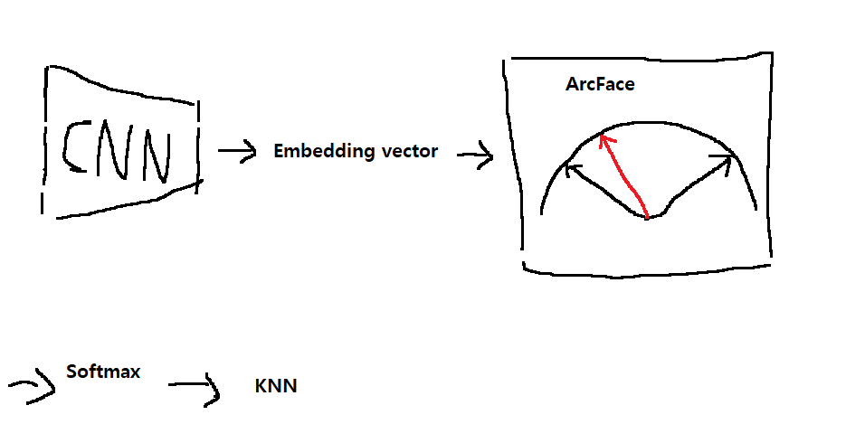

## 대회 개요
- Computer Vision
- Deep Metric Learning

대회 참여 날짜 : 2022년 3월 7일 
(앞서 다른 대회들로 인하여 늦게 참가하게 되었습니다.)
  
Site : 

[Happywhale - Whale and Dolphin Identification](https://www.kaggle.com/c/happy-whale-and-dolphin)

   

## 3월 7일

- baseline code 70% 리뷰 완료. [[Baseline code]](https://www.kaggle.com/aikhmelnytskyy/happywhale-arcface-baseline-eff7-tpu-768-concat)
    - ArcFace의 이해.     [[ArcFace 논문링크]](https://arxiv.org/abs/1801.07698)
        - ArcFace는 각도 기반으로 margin을 주어 서로 다른 클래스 구분을 명확히 함
        - [[참고링크(한글)]](https://soobarkbar.tistory.com/60)     [[참고링크(한글)]](https://hongl.tistory.com/189)      [[직관적인이해]](https://www.kaggle.com/chankhavu/keras-layers-arcface-cosface-adacos)
        - [[참고링크(한글)]](https://norman3.github.io/papers/docs/arcface.html)
    - TPU와 Tensorflow는 조금 더 공부가 필요함.
- csv file만으로 score를 평가하는 방식이라는 점에서 ensemble에 사용되는 모델을 6개이상 사용.
- inference(추론)에서는 학습하지 않는 label에 대해서 결과값을 도출해야 할필요가 있어서, threshold값을 평가지표인 MAP@5 score로 최적화 시키는 방안도 고려중.

## 3월 8일

- validation에서 new_indivisual class를 어떻게 처리해주어야 하나는지에 대한 고민.
(train data에는 new_indivisual class가 존재하지 않지만, test에는 있다고 함.)
- baseline code 리뷰완료 및 pytorch로 EDA 연습.

## 3월 9일

- 학습을 할때, 각 iterations마다 loss를 누적해서, batch size를 크게 키우는 효과를 얻으려고 의논함.
- 제공받은 서버에서 환경설정 및 pytorch 연습
- ArcFace 및 KNN을 pytorch로 일부 코딩.
- 다른 모델들과 imbalance한 class에서 어떤 모델을 쓰면 좋을지 검색.
(아직 그럴듯한 방법론은 찾지 못했음.)
- Crop된 이미지로 적용해서 모델구현하려고 함.

## 3월 10일
참고자료 : [Deep Metric Learning](https://www.youtube.com/watch?v=hH-UgJ--r_4)  
- Embedding이란 : 이미지의 feature vector(이미지의 고유한(?) 특성 vector)

- 전체적인 흐름에 대한 설명.
 
- Arcface에 대한 설명
  - 1 : 임베딩백터를 노멀라이즈 
  2 : (d*n)Weight를 노멀라이즈 
   
  1과 2를 내적을 하면 
  1과2의 각도인 cos세타가 나오게되고,  

  마진을 더해주기 위해서  
  cos에 arrcos을 씌우고, 그러면 각도인 세타가 나오고 
  세타에다가 마진을 더해주고, 
  다시 cos을 씌워줍니다. 
   결과물 cos(세타+m) 에 s를 곱해주고, softmax를 태우고, loss를 구하게 됩니다. 

- Test는 어떻게 하는가..
  - ㅁㄴㅇ
- 대회 접근방법
  - 모델의 train이 능수능란하게 되어야 한다.
  - test image에 대해서는 나중에 label를 직접 해볼것이다.

 
loss function은 softmax를 변형하였는데, 

