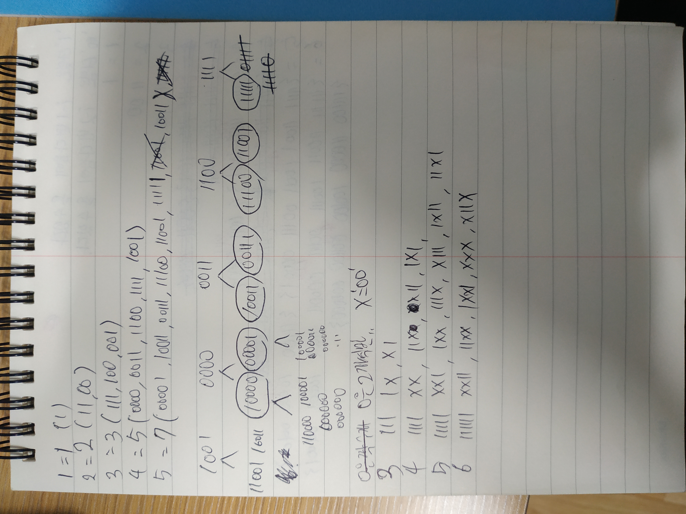

# 문제 설명
지원이에게 2진 수열을 가르쳐 주기 위해, 지원이 아버지는 그에게 타일들을 선물해주셨다. 그리고 이 각각의 타일들은 0 또는 1이 쓰여 있는 낱장의 타일들이다.

어느 날 짓궂은 동주가 지원이의 공부를 방해하기 위해 0이 쓰여진 낱장의 타일들을 붙여서 한 쌍으로 이루어진 00 타일들을 만들었다. 결국 현재 1 하나만으로 이루어진 타일 또는 0타일을 두 개 붙인 한 쌍의 00타일들만이 남게 되었다.

그러므로 지원이는 타일로 더 이상 크기가 N인 모든 2진 수열을 만들 수 없게 되었다. 예를 들어, N=1일 때 1만 만들 수 있고, N=2일 때는 00, 11을 만들 수 있다. (01, 10은 만들 수 없게 되었다.) 또한 N=4일 때는 0011, 0000, 1001, 1100, 1111 등 총 5개의 2진 수열을 만들 수 있다.

우리의 목표는 N이 주어졌을 때 지원이가 만들 수 있는 모든 가짓수를 세는 것이다. 단 타일들은 무한히 많은 것으로 가정하자.<br/>
<br/>


# 제한사항
입력: 첫 번째 줄에 자연수 N이 주어진다. (1 ≤ N ≤ 1,000,000)<br/>
출력 : 첫 번째 줄에 지원이가 만들 수 있는 길이가 N인 모든 2진 수열의 개수를 15746으로 나눈 나머지를 출력한다.<br/>
시간제한 : 0.75초<br/>
메모리제한 : 256MB<br/>
<br/>

# 입출력 예

<table class="tg">
<thead>
  <tr>
    <th class="tg-0pky">입력</th>
    <th class="tg-0lax">출력</th>
  </tr>
</thead>
<tbody>
  <tr>
    <td class="tg-0lax">4</td>
    <td class="tg-0lax">6</td>
  </tr>

</tbody>
</table>


# Idea


<p>손으로 풀다보니 규칙성을 발견하게 되었고, 첫번째 그림처럼, 트리형태를 생각해 보기도하고, 00은 무조건 짝수번째에만 가능하다는것을 유추해냈다. 그러니깐 00을 추가하려면 2번 다음에서야 가능하다.<br/>
그러면 현재 i번재라고 하면,<br/> i-1 번째에서는 1만 추가해야하며,<br/>
i-2번재에서는 00만 추가해줘야 한다.<br/>
그렇게 풀다보면, 피보나치 수열이라는 것을 알아낼수있다!!
</p>


# Code
```python
def solution(n):
  seed = {1:1, 2:2}
  for i in range(3, n+1):
    seed[i] = (seed[i-1] + seed[i-2]) % 15746
  return seed[n]

if __name__ == "__main__":
  n = int(input())
  print(solution(n))
```


# Explain
<p>dictionary로 문제를 풀었더니, pass를 했다.<br/>하지만 416ms정도의 시간이 걸렸다.<br/>
지난번에 Prime를 구하는 문제에서 에라토스테네스의체에 관해 알아냈는데, 피보나치 수열도 분명히 무언가가 있지 않을까 하고, 구글링을 열심히 해보았다.<br/></p>

## Matrix Exponentiation 

<p>pytorch를 공부하면서 행렬과 vector에 대해 익숙해져있는 상태인데, Matrix Exponentiation이라는 방법이 있다고 한다.<br/></p>

```
If n is even then k = n/2:
F(n) = [2*F(k-1) + F(k)]*F(k)

If n is odd then k = (n + 1)/2
F(n) = F(k)*F(k) + F(k-1)*F(k-1)
```


```python
import math

def fibo(n):
    phi = (1 + math.sqrt(5)) / 2
    return (round(pow(phi, n) / math.sqrt(5))) % 15746

if __name__ == '__main__':
    n = int(input())
    print(fibo(n+1))
```
위의 코드는 overflow가 발생했다. 값이 너무 커져버렸다.<br/>
%15756을 잘써야 한다. 한번에 계산하는게 아니라<br/>

```python

n = int(input())
init = [[1, 1], [1, 0]]

def multiply(a, b):
    temp = [[0] * 2 for _ in range(2)]
    for i in range(2):
        for j in range(2):
            for k in range(2):
                temp[i][j] += (a[i][k] * b[k][j])

    for i in range(2):
        for j in range(2):
            temp[i][j] %= 15746
    return temp

def matrix_pow(n, M):
    if n == 1:
        return M
    if n % 2 == 0:
        temp = matrix_pow(n//2, M)
        return multiply(temp, temp)
    else:
        temp = matrix_pow(n-1, M)
        return multiply(temp, M)

print(matrix_pow(n, init)[0][0])
```
<p>최종 소스코드..<br/>


<a href="https://www.geeksforgeeks.org/matrix-exponentiation/">https://www.geeksforgeeks.org/matrix-exponentiation/</a><br/>
이곳을 참고했다.</p>
<br/>
<br/>
<br/>
<br/>

# References
<ul>
  <li><a href="https://www.youtube.com/watch?v=blM-m6iMHvM" target="_blank">https://www.youtube.com/watch?v=blM-m6iMHvM</a></li>
  <li><a href="https://www.youtube.com/watch?v=EEb6JP3NXBI&t=278s" target="_blank">https://www.youtube.com/watch?v=EEb6JP3NXBI&t=278s</a></li>
  <li><a href="https://www.geeksforgeeks.org/matrix-exponentiation/" target="_blank">https://www.geeksforgeeks.org/matrix-exponentiation/</a></li>
  <li><a href="https://www.geeksforgeeks.org/program-for-nth-fibonacci-number/?ref=lbp" target="_blank">https://www.geeksforgeeks.org/program-for-nth-fibonacci-number/?ref=lbp</a></li>
</ul>  
