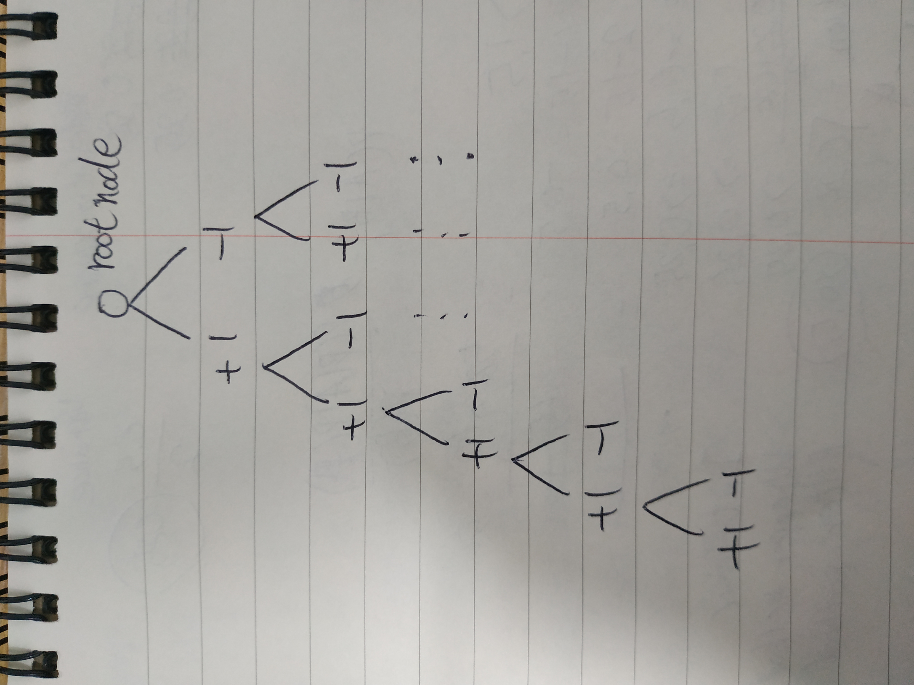

# 문제 설명
n개의 음이 아닌 정수들이 있습니다.<br/> 이 정수들을 순서를 바꾸지 않고 적절히 더하거나 빼서 타겟 넘버를 만들려고 합니다.<br/> 예를 들어 [1, 1, 1, 1, 1]로 숫자 3을 만들려면 다음 다섯 방법을 쓸 수 있습니다.<br/>
```
-1+1+1+1+1 = 3
+1-1+1+1+1 = 3
+1+1-1+1+1 = 3
+1+1+1-1+1 = 3
+1+1+1+1-1 = 3
```
사용할 수 있는 숫자가 담긴 배열 numbers, 타겟 넘버 target이 매개변수로 주어질 때 숫자를 적절히 더하고 빼서 타겟 넘버를 만드는 방법의 수를 return 하도록 solution 함수를 작성해주세요.
<br/>


# 제한사항
<ul>
<li>주어지는 숫자의 개수는 2개 이상 20개 이하입니다.</li>
<li>각 숫자는 1 이상 50 이하인 자연수입니다.</li>
<li>타겟 넘버는 1 이상 1000 이하인 자연수입니다.</li>
</ul>
<br/>


# 입출력 예

<table class="tg">
<thead>
  <tr>
    <th class="tg-0pky">numbers</th>
    <th class="tg-0lax">target</th>
    <th class="tg-0lax">return</th>
  </tr>
</thead>
<tbody>
  <tr>
    <td class="tg-0lax">[1,1,1,1,1]</td>
    <td class="tg-0lax">3</td>
    <td class="tg-0lax">5</td>
  </tr>
  <tr>
    <td class="tg-0lax">[4,1,2,1]</td>
    <td class="tg-0lax">4</td>
    <td class="tg-0lax">2</td>
  </tr>

</tbody>
</table>


# 입출력 예 설명
입출력 예 #1

문제 예시와 같습니다.

입출력 예 #2

```
+4+1-2+1 = 4
+4-1+2-1 = 4
```
총 2가지 방법이 있으므로, 2를 return 합니다.
<br/>


# Idea
<p>처음에 Tree 구조를 떠올렸다.
<br/><br/><br/>
문제에서 더하는 경우와 빼는 경우만 고려하므로,<br/>
root node를 0으로 설정하고, 최대 20개의 노드의 갯수만큼 binary tree를 구성한 다음,<br/>
leaf node까지의 합이 target인 갯수를 return 하면 되는문제로 풀려고하였으나,<br/>
더 쉬운 방법이 떠올랐다!!!<br/><br/><br/>
각각의 노드들의 부호를 더하기와 빼기를 구해준다음, product를 구하는것이다.
</p>

```python
count = 0
    tuple_list = [(4, -4), (1, -1), (2, -2), (1, -1)]
    for line in product(*tuple_list):
        print(line)
        if target == sum(line):
            count += 1
```
```python
for value_one in tuple(node, -node):
    for value_two in tuple(node, -node):
        result = (str(value_one), str(value_two))
        print result
```


# Code
```python
from itertools import product
def solution(numbers, target):
    l = [(x, -x) for x in numbers]
    
    s = list(map(sum, product(*l)))
    
    # print(*product(*l))
    # count = 0
    # tuple_list = [(4, -4), (1, -1), (2, -2), (1, -1)]
    # for line in product(*tuple_list):
    #     print(line)
    #     if target == sum(line):
    #         count += 1
    # print(count)
    return s.count(target)
```

# Explain
추후에 machine learning, deep learning, pytorch, data structure 등 이론적인 부분에 대해서 포스팅을 해야겠다.!!!<br/>
CTF 포스팅은 언제하지...
<br/>


# References
<ul>
  <li><a href="https://www.geeksforgeeks.org/python-all-possible-n-combination-tuples/" target="_blank">https://www.geeksforgeeks.org/python-all-possible-n-combination-tuples/</a></li>
  <li><a href="https://www.geeksforgeeks.org/python-all-pair-combinations-of-2-tuples/" target="_blank">https://www.geeksforgeeks.org/python-all-pair-combinations-of-2-tuples/</a></li>
  
</ul>  
