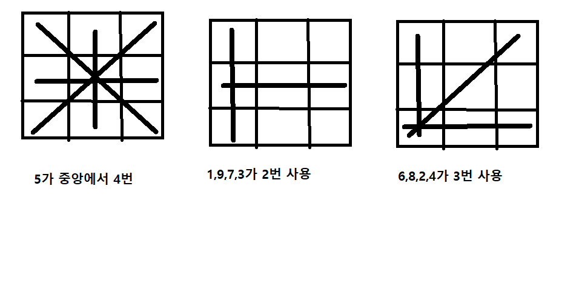

# 문제 설명

<p>
We define a magic square to be an n &times; n matrix of distinct positive integers from 1 to n<sup>2</sup> where the sum of any row, column, or diagonal of length n is always equal to the same number: the magic constant.</br></br>

You will be given a 3 X 3 matrix s of integers in the inclusive range [1, 9]. We can convert any digit a to any other digit b in the range [1, 9] at cost of |a - b|. Given s, convert it into a magic square at minimal cost. Print this cost on a new line.</br></br>

Note: The resulting magic square must contain distinct integers in the inclusive range [1, 9].
</p>


<br/><br/><br/>

# 제한사항
<h2>Input Format</h2>
Each of the 3 lines contains three space-separated integers of row s[i].<br/>

<h2>Output Format</h2>
int: the minimal total cost of converting the input square to a magic square
<h2>Others</h2>
<ul>
<li>s[i][j] &in; [1,9]</li>
</ul>

<br/><br/><br/>


# 입출력 예
Sample Input 0
```
4 9 2
3 5 7
8 1 5
```
Sample Output 0
```
1
```

# Idea
<p>
magic square에 대해서 설명을 하자면, 행, 열, 대각선 별로 합이 같아야 합니다.<br/>
그리고 모든 입력은 3by3의 형태이고, 1~9까지의 element가 존재합니다.<br/>
저는 경우의 수를 구하고, 나올수있는 조합을 다 구해봤습니다.<br/>
조합을 미리 다 구해본 이유는, 백준의 소수판별 문제를 풀면서 많이 느꼇지만, 어느정도 범위가 주어진다면 주어진 범위의 정답을 모두 다 구하는것이 속도측면에서 더 월등한것을 느꼇습니다.<br/>
참고로 이 정도의 조합이면, 별로 차이는 없을것 같긴합니다.<br/>
코드에 설명을 첨부하겠습니다.<br/>
</p>
<br/><br/><br/>

# Code
```python
from itertools import combinations

combi = combinations('123456789', 3)
# 1~9까지의 숫자중 서로 다른 3가지의 숫자의 모든 조합을 구함.
# 3가지는 행,열,대각선 모든 조합이 3가지이므로..
select_num = list()
for data in combi:
  num1, num2 ,num3 = data
  
  if 15 == int(num1) + int(num2) + int(num3):
    # 3가지의 숫자의 합이 15인것을 찾는다.
    # 15이여지만 행,열,대각선의 합이 15일수있다.
    select_num.append(num1)
    select_num.append(num2)
    select_num.append(num3)

print(select_num)

from collections import Counter
dict_counter = Counter(select_num)
print(dict_counter)
```
```
['1', '5', '9', '1', '6', '8', '2', '4', '9', '2', '5', '8', '2', '6', '7', '3', '4', '8', '3', '5', '7', '4', '5', '6']
Counter({'5': 4, '6': 3, '8': 3, '2': 3, '4': 3, '1': 2, '9': 2, '7': 2, '3': 2})
```
출력을 보면 5가 4번, 6,8,2,4가 3번 1,9,7,3이 2번씩 사용됬습니다.
이걸 metrix의 형태에 맞춰주기만 하면됩니다. 어떻게 맞춰야 할까요?<br/>
<br/>
선들이 겹치는 곳을 잘 보시면
4개가 겹치는 곳이 1개<br/>
2개가 겹치는 곳이 4개<br/>
3개가 겹치는 곳이 4개 이렇게 표현되어 있습니다.<br/>
9개의 자리의 위치를 다 찾았습니다!!!
그러면 list로 미리 만들어서 확인해보면,
```
array = [
  [[8, 1, 6],[3, 5, 7],[4, 9, 2]],
  [[6, 7, 2],[1, 5, 9],[8, 3, 4]],
  [[2, 9, 4],[7, 5, 3],[6, 1, 8]],
  [[4, 3, 8],[9, 5, 1],[2, 7, 6]],
  [[6, 1, 8],[7, 5, 3],[2, 9, 4]],
  [[2, 7, 6],[9, 5, 1],[4, 3, 8]],
  [[4, 9, 2],[3, 5, 7],[8, 1, 6]],
  [[8, 3, 4],[1, 5, 9],[6, 7, 2]]
  ]
```
이제 남은 과정은 입력으로 주어진, 3 by 3의 list를 제가 만든 9개의 list와 동일한 자리의 값을 비교하면서, 절대값의 차이를 구한다음, 총 9번 수행한 후, 가장 적은 차이의 값을 출력하면 되겠습니다.!!

## 최종코드
```python
def getCost(arr, input_array):
    cost = 0
    for i in range(3):
        for j in range(3):
            cost += abs(arr[i][j] - input_array[i][j])
    return cost

def formingMagicSquare(s):
    # Write your code here
    
    array = [
    [[8, 1, 6],[3, 5, 7],[4, 9, 2]],
    [[8, 3, 4],[1, 5, 9],[6, 7, 2]],
    [[6, 1, 8],[7, 5, 3],[2, 9, 4]],
    [[6, 7, 2],[1, 5, 9],[8, 3, 4]],
    [[4, 3, 8],[9, 5, 1],[2, 7, 6]],
    [[4, 9, 2],[3, 5, 7],[8, 1, 6]],
    [[2, 7, 6],[9, 5, 1],[4, 3, 8]],
    [[2, 9, 4],[7, 5, 3],[6, 1, 8]],
    ]
    mincost = 987987
    for row in array:
        cost = getCost(row, s)
        mincost = min(mincost, cost)
    return mincost
```


# Explain
생략.


<br/><br/><br/>
다른사람의 풀이 #1
<hr align="left" style="border: solid 10px gray;">

```python
def generateAllMagicSquares():
    import numpy as np
    magic = [[8, 1, 6],[3, 5, 7],[4, 9, 2]]
    rotations = [np.rot90(magic, x) for x in range(4)]
    reflections = [np.flip(x, 1) for x in rotations]
    all_magic = rotations + reflections
    
    return all_magic
```
rot90를 돌려도 이론적으로 맞게 되네요!!...ㄷㄷ

<hr align="left" style="border: solid 10px gray;">
<br/><br/>


# References
<ul>
  <li><a href="https://www.youtube.com/watch?v=FMxA_g9oQnA" target="_blank">https://www.youtube.com/watch?v=FMxA_g9oQnA</a></li>
  
  
</ul>

