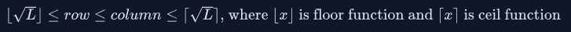

# 문제 설명
An English text needs to be encrypted using the following encryption scheme.<br/>
First, the spaces are removed from the text. Let L be the length of this text.<br/>
Then, characters are written into a grid, whose rows and columns have the following constraints:<br/>


<br/><br/><br/>
L은 공백을 제거한 문자열의 길이이고,<br/>
row와 column은 row &times; column &ge; L을 만족하는 최소값이 row, column이 된다.<br/>
또한 row, column은 L에 root한 값의 버림값보다 크거나 같고, 올림값보다는 작거나 같다.<br/>
공백을 제거한 문자열을 column 자리수 만큼 나누면 row개의 문자열이 완성 된다.
그렇게 만들어진 문자열들을 다시 column을 기준으로 재배열 한후에, 각 라인의 끝에 공백을 넣어서 리턴을 해주면 된다.


<br/><br/><br/>

# 제한사항

## Input Format
- One line of text, the string s

## Output Format

- string: the encrypted string


## Others
- 1 &le; length of s &le; 81


<br/><br/><br/>


# 입출력 예
Sample Input
```
haveaniceday
```
Sample Output
```
hae and via ecy
```

# Idea

<p>
영어공부를 열심히 했으면 정말 쉽게 풀렸을 텐데, 이해를 못해서 해맸습니다.<br/>
문제는 정말 쉽습니다.<br/>


</p>
<br/><br/><br/>

# Code

```python
def encryption(s):
    # Write your code here
    s.replace(" ", "") #saco lo espacios
    L = math.sqrt(len(s))
    columns = math.ceil(L)
    result = [s[i::columns] for i in range(columns)]
    return " ".join(result)
```


# Explain
먼저 입력받은 String s의 공백을 제거합니다.<br/>
그럼 다음 root를 씌워서 제곱근을 구하고 max columns을 구하기 위해서 올림합니다.<br/>
그런 다음 list comprehension을 이용하여 column을 기준으로 새로운 리스트를 만들고, return할 때, 문자열로 바꾸어 줍니다.<br/>


<br/><br/><br/>


<!-- # References

<ul>
  <li><a href="https://medium.com/@mrunankmistry52/non-divisible-subset-problem-comprehensive-explanation-c878a752f057" target="_blank">https://medium.com/@mrunankmistry52/non-divisible-subset-problem-comprehensive-explanation-c878a752f057</a></li>
  <li><a href="https://gaegosoo.tistory.com/62" target="_blank">https://gaegosoo.tistory.com/62</a></li>
  
</ul> -->

