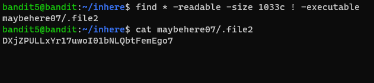
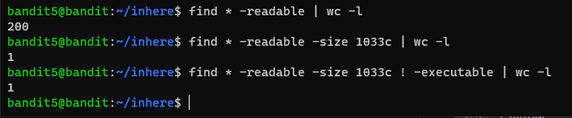

# 문제설명

Level Goal 
The password for the next level is stored in a file somewhere under the inhere directory and has all of the following properties: 

human-readable 
1033 bytes in size 
not executable  
Commands you may need to solve this level 
ls, cd, cat, file, du, find 

# 문제풀이

  

문제를 보면 
사람이 읽을수 있고, 
크기가 1033바이트이고, 
실행불가능하다는 조건이 있다. 

find command를 사용해서 해당조건의 문제를 해결하였다.

유닉스 시스템에서는 명령문과 아규먼트 사이에 빈칸이 있어야 합니다.(!와-executable사이의 공백에 관한 설명. !는 반대의 의미로 사용되었다.) 

이 문제를 해결하기위해, shell script를 작성할수도있고, test(이걸로 되나?)를 쓸수도 있을것이다. 선택은 각자 알아서.!!!!

아래는 갯수를 확인하는 방법

