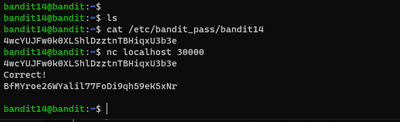

# 문제설명

Level Goal 
The password for the next level can be retrieved by submitting the password of the current level to port 30000 on localhost. 
 
Commands you may need to solve this level 
ssh, telnet, nc, openssl, s_client, nmap 

# 문제풀이

next level의 암호는 current level의 30000port에 current level의 password를 제출하면 된다고 하니...30000 port에 접속하면 될것같습니다. 

nc를 이용하면 특정호스트의 특정포트로 접속하는것과 로컬호스트의 특정포트를 열어두는것들도 할수있습니다.

사용하기 나름이죠!

