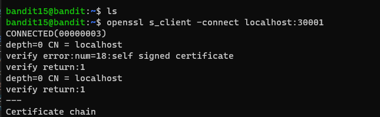
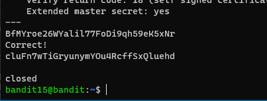

# 문제설명

Level Goal 
The password for the next level can be retrieved by submitting the password of the current level to port 30001 on localhost using SSL encryption. 
 
Helpful note: Getting “HEARTBEATING” and “Read R BLOCK”? Use -ign_eof and read the “CONNECTED COMMANDS” section in the manpage. Next to ‘R’ and ‘Q’, the ‘B’ command also works in this version of that command… 
 
Commands you may need to solve this level 
ssh, telnet, nc, openssl, s_client, nmap 

# 문제풀이

<strong>이전문제와 비슷하다. 다만 ssl encryption을 사용해서 제출해야한다.</strong>

 

<a href="https://docs.pingidentity.com/bundle/solution-guides/page/iqs1569423823079.html">https://docs.pingidentity.com/bundle/solution-guides/page/iqs1569423823079.html</a>  
<a href="https://m.blog.naver.com/jihye2340/220659855526">https://m.blog.naver.com/jihye2340/220659855526</a> 
자료를 찾다보니 위에2개가 괜찮은것같다!

