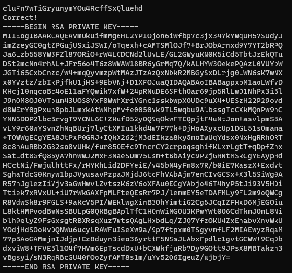

# 문제설명
<hr size=10 noshade>
Level Goal<br/>
The credentials for the next level can be retrieved by submitting the password of the current level to a port on localhost in the range 31000 to 32000.<br/> First find out which of these ports have a server listening on them. <br/>Then find out which of those speak SSL and which don’t. <br/>There is only 1 server that will give the next credentials, the others will simply send back to you whatever you send to it.<br/>
<br/>

Commands you may need to solve this level<br/>
ssh, telnet, nc, openssl, s_client, nmap<br/>
<hr size=10 noshade>

# 문제풀이


<p>오호...재밌어지기 시작했다. 31000~32000사이에서 열려있는 port를 찾고 현재레벨의 패스워드를 입력하면, 그중에서 단 1개의 포트에서만 flag를 준다고 한다.<br/></p>

<p><br/>이렇게 하니깐 SERBVICE가 SSL인지 아닌지 확인이 안된다.<br/></p>


<p><br/>보면 31790과 31518두개가 SSL인데 echo라고 되있는거는 아마 나의 입력을 그대로 되돌려주는것 같다...<br/>나머지 출력문장들을 한번보게되면 "Wrong! Please enter the correct current password"라는 문장이 반복되는것과 그에 해당하는 포트가 31790인것을 출력문 3번째줄에서 확인할수 있다.<br/> 만약 정답이 아니라면, 어떤 입력이 들어오든지 echo로 되돌려주면 되지만, 정답인지 아닌지 확인하기 위해서 필요하다고 생각했다.<br/><br/><br/></p>
<p></p>

```linux
openssl s_client -connect localhost:31790
```




<p>점점 문제들이 어려워진다기 보다 여러가지르 적용하기 시작했다 ㅋㅋㅋ<br/>key file로 만들어서 다시 접속하면 끝이다!</p>
<p></p>
<p></p>

```
ssh -i keyfile.keyfile -p 2220 bandit17@bandit.labs.overthewire.org
```


