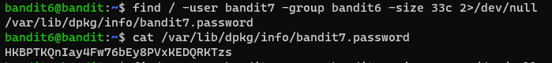

# 문제설명

Level Goal 
The password for the next level is stored somewhere on the server and has all of the following properties: 

owned by user bandit7 
owned by group bandit6 
33 bytes in size  
Commands you may need to solve this level 
ls, cd, cat, file, du, find, grep 

# 문제풀이

이 문제도 파일검색 유형의 문제이다.   

검색 keyword 3개를 명령어에 입력해준다.

이 문제를 풀려면 리눅스의 파일권환에 대한 개념이 필요하다

rwx의 종류의 파일권한이 있는데, read, write, excutable이다. 참고로 find 명령어 다음에 파일위치를 / 으로 주었는데, root directory라는 의미이다.

이러한 파일권환을 특정사용,특정그룹,나머지로 구분해 적용시킬수있다.

자세한 설명은 <a href="https://dogleg.co.kr/?p=43">https://dogleg.co.kr/?p=43</a>와  <a href="https://yusang.tistory.com/21">https://yusang.tistory.com/21</a>를 참고하면 좋을것 같다.

