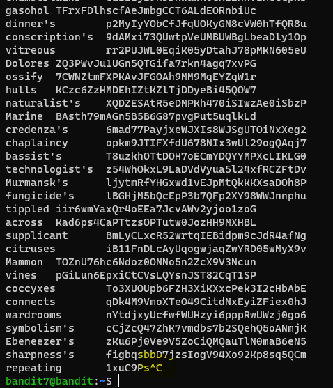
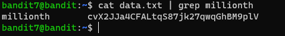

# 문제설명

Level Goal 
The password for the next level is stored in the file data.txt next to the word millionth  

Commands you may need to solve this level 
grep, sort, uniq, strings, base64, tr, tar, gzip, bzip2, xxd 

# 문제풀이

무작정 data.txt파일을 읽으려하면 위에같은 수많은 글자들이 나올것이다... 이 글자들의 패턴을 보면, key:value의 pair를 갖는것을 알수있다. 추측이지만 millionth는 key에 해당하는것 같다.

문제에서도 <strong>millionth</strong>의 다음 단어에 있다고 한다.

grep 명령어로 millionth를 검색해주면 해당 문자열의 라인이 출력된다.!!!

참고로 find, grep, awk 같은 명령어들은 정말 자주 쓰인다.

Linux를 사용하다보면 정말 자주 사용하는 명령어들은 옵션값들도 유심히 보길 추천한다.

tip) 2>/dev/null 쓰레기통!!

