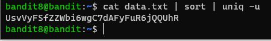

# 문제설명

Level Goal 
The password for the next level is stored in the file data.txt and is the only line of text that occurs only once 
 
Commands you may need to solve this level 
grep, sort, uniq, strings, base64, tr, tar, gzip, bzip2, xxd 

# 문제풀이

  

이전 문제와 동일하게 data.txt file에 flag가 있지만, 이번에는 유일하게 딱 번만 나온다고 한다.

리눅스에서 uniq 명령어를 사용할때 주의할점은   홍길동
 이순신 장영실 이순신 홍길동  이라는 문자열이 있다고 할때 uniq명령어를 사용하면 장영실이 나올것을 예측하지만, 
uniq는 명령어는 인접한 문자열들만 확인한다는 것입니다.
 uniq는 명령어는 각각 1개씩의 문자로 인지하고 출력합니다.

그래서 uniq의 man page에도 sort를 하고 사용하라고 나와있습니다.

sort를 하게 되면,  이순신 이순신 장영실 홍길동 홍길동  이 나오게되고, 출력을 하게되면 2 이순신 1 장영실 2 홍길동 이런식으로 나오게 됩니다.

uniq의 적절한 옵션을 취하여 1개의 문자열만 출력하기도 하고,  c라는 옵션을 개수도 같이 출력해줍니다!!!

