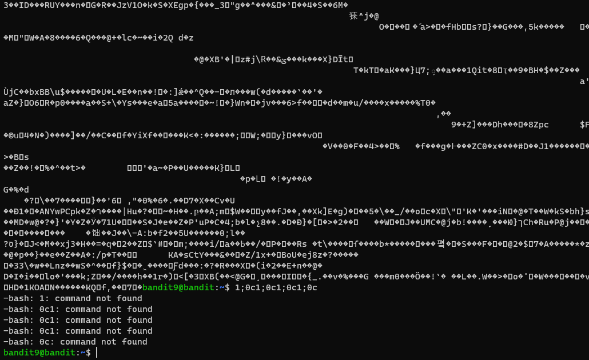
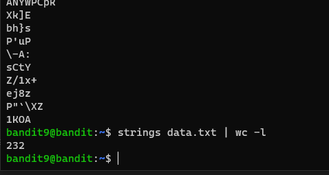
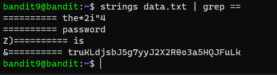

# 문제설명

Level Goal 
The password for the next level is stored in the file data.txt in one of the few human-readable strings, preceded by several ‘=’ characters. 
 
Commands you may need to solve this level 
grep, sort, uniq, strings, base64, tr, tar, gzip, bzip2, xxd 

# 문제풀이

flag는 사람이 읽을수있는 문자열이고, "="문자 몇개가 앞에 온다라...   

<strong>find human readable string in file linux</strong> 라고 구글에 검색하게 되면 strings라는 command를 쉽게 확인해 볼수있다.

232개가 나온다. 이중에 flag가 있을것이다. 아직 쓰지않은 hint인 "="을 grep으로 검색해보자.

 
 

문제에서 several이라 하여, 2개를 넣어봤다. 그랬더니 flag로 추정되는 문자열을 확인해볼수 있었다.

