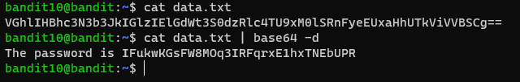

# 문제설명

Level Goal 
The password for the next level is stored in the file data.txt, which contains base64 encoded data 
 
Commands you may need to solve this level 
grep, sort, uniq, strings, base64, tr, tar, gzip, bzip2, xxd 

# 문제풀이

 base64의 명령어만 사용할줄 알면 풀리는 문제이다. 

문제에서 base64 encoded data라고 했으니, 나는 base64 decode를 하면 되겠다.

CTF를 하면서 느낀건데, ==으로 끝나면 보통 base64이다.

