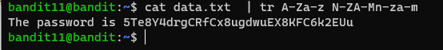
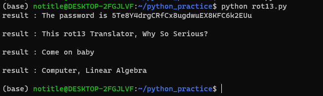

# 문제설명
<hr size=10 noshade>
Level Goal<br/>
The password for the next level is stored in the file data.txt, where all lowercase (a-z) and uppercase (A-Z) letters have been rotated by 13 positions<br/>
<br/>
Commands you may need to solve this level<br/>
grep, sort, uniq, strings, base64, tr, tar, gzip, bzip2, xxd<br/>
<hr size=10 noshade>

# 문제풀이


<p><br/>문제설명을 듣고 시저 알고리즘이 떠올랐다.이것도 나중에 알고리즘풀이에 추가해봐야겠다.<br/></p>
<p>구글에 <strong>alphabet rotational command in linux</strong> 라고 검색하면 tr이라는 command를 확인해볼수있다.<br/>그러면 man page에 가서 사용법을 확인해보자.(구글에서 마저 검색하는것이 마저 편할수도있다.)</p>
<p>본인이 센스가 조금 있고, 기억력이 좋다면, The password is 까지도 확인이 가능할것이다.<br/>힌트는 이전문제의 flag형식에 있다 ㅎㅎ</p>

<p>data.txt file의 content을 입력으로 받아서, tr command를 실행시킨다.<br/>여기서 규칙은 13번 이동시킨다는것이다. 대소문자 포함.</p>
<p>다시 풀어서 써보면, A-Z -> N-M까지인데, 알파벳은 Z에서 끝나게되므로 다시 A를 이어줘야 한다.<br/>최총적으로 대문자 A-Z까지를 N-ZA-M까지 변환해주고, 이걸 소문자에도 적용시키면 된다!!</p>
<p>다음은 tr명령어를 사용하지않고, 코드를 작성한 예제이다.</p>

```python
import string

lower = string.ascii_lowercase
upper = string.ascii_uppercase

with open("data.txt", "r") as f:
  for line in f:
    result = ""
    for char in line:
      if char == ' ':
        result += ' '
        continue  

      elif char in lower:
        index = lower.find(char)
        rotIndex = index + 13

        if rotIndex > 25:
            rotIndex = rotIndex % 25 - 1
        result += lower[rotIndex]
        continue

      elif char in upper:
        index = upper.find(char)
        rotIndex = index + 13

        if rotIndex > 25:
            rotIndex = rotIndex % 25 - 1
        result += upper[rotIndex]
        continue
      else :
        result += char
        continue
  print(f"result : {result}")
```

<p>코딩을 하면서 보니 flag가 alphabet upper, lower cases 그리고 space에 대해서만 처리를 따로 해주고, 나머지는 문자는 그대로 받게 해두었다.<br/>그 결과, 특수문자들도 그대로 살리는(?)게 되었다!!</p>



