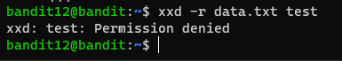
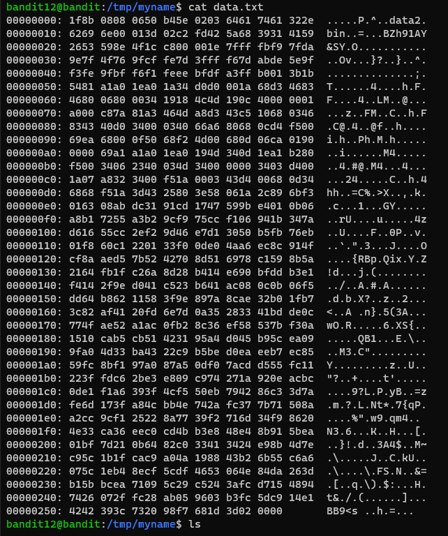
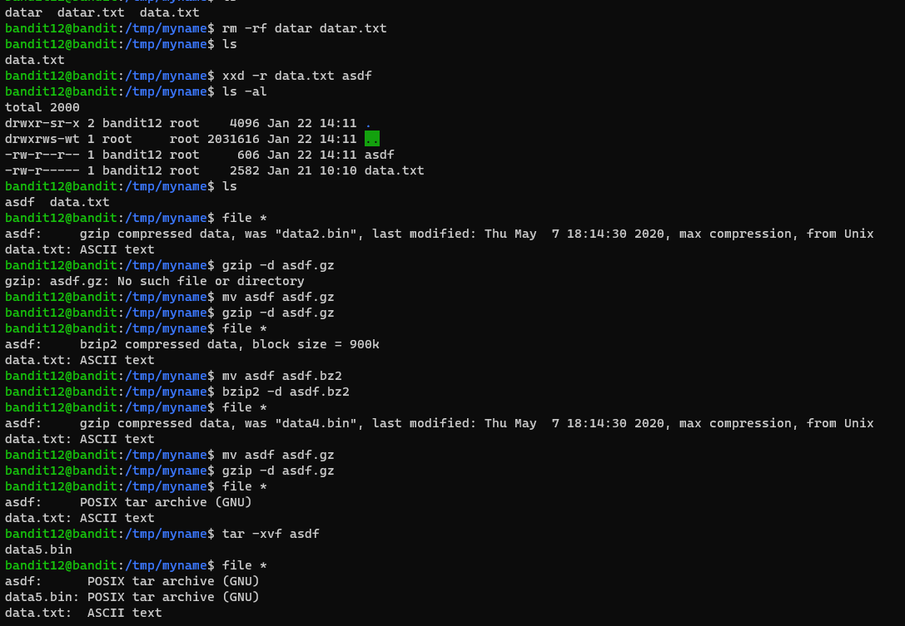
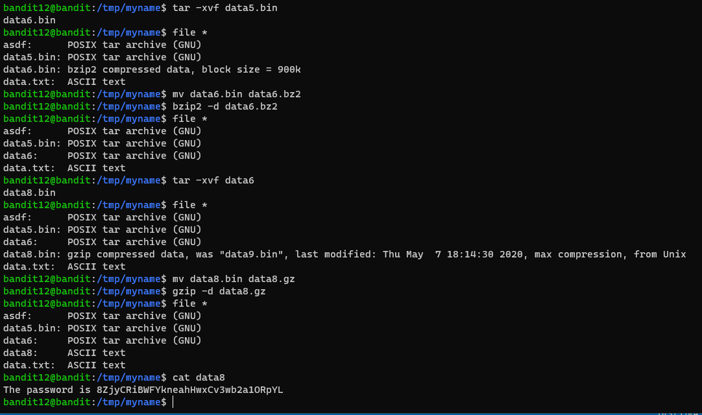

# 문제설명

Level Goal   
The password for the next level is stored in the file data.txt, which is a hexdump of a file that has been repeatedly compressed. 
For this level it may be useful to create a directory under /tmp in which you can work using mkdir. 
For example: mkdir /tmp/myname123. Then copy the datafile using cp, and rename it using mv (read the manpages!)   
 
 

Commands you may need to solve this level   
grep, sort, uniq, strings, base64, tr, tar, gzip, bzip2, xxd, mkdir, cp, mv, file

# 문제풀이

 hex dump file에 여러번 압축된곳에 flag가 있다고 합니다. /tmp 위치에 directory를 만들어서 사용하면 유용합니다.

못 먹어도 Go, 일단 압축부터 풀어 봅시다.

ㅋㅋㅋ 하라는대로 해야겠네요 ㅎ..

편하게 인터넷에 있는걸 쓰는게 더 나을지도..

