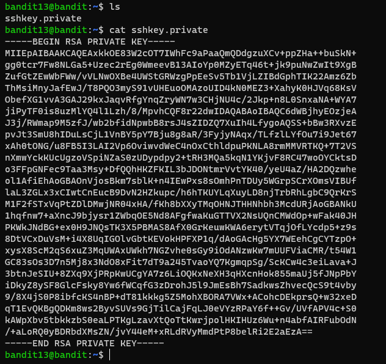
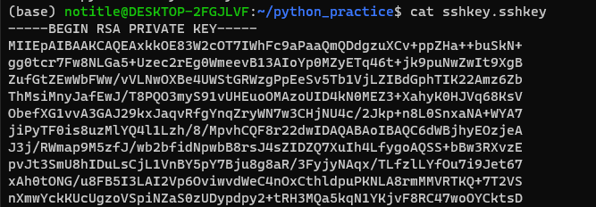
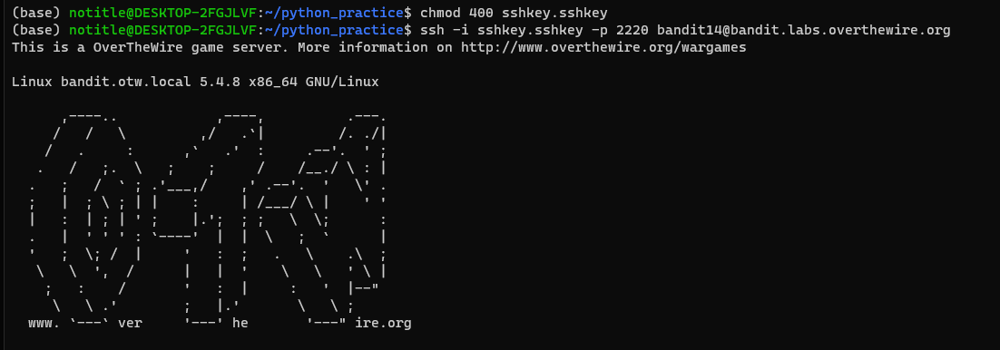

# 문제설명

Level Goal 
The password for the next level is stored in /etc/bandit_pass/bandit14 and can only be read by user bandit14. For this level, you don’t get the next password, but you get a private SSH key that can be used to log into the next level. Note: localhost is a hostname that refers to the machine you are working on 
 
Commands you may need to solve this level 
ssh, telnet, nc, openssl, s_client, nmap 

# 문제풀이

 음.. bandit14의 password는 /etc/bandit_pass/bandit14에 있는데, bandit14 유저만이 읽을수있다. bandit13에서는 bandit14의 password를 얻을수가 없다. 하지만 ssh key가 있다. bandit14에 접속할수있는...

그러면 ssh key를 이용해서 bandit14로 접속해서 /etc/bandit_pass/bandit14에 가서 password를 확인해보자!!

ssh key인것을 확인하였으니, 접속자용 터미널을 하나 만들어줍니다. 

ssh에 접속하고자 할때, password입력 방식보다 public key/private key를 만들어 원격에서 로그인하려는 접속자들은 publice key를 복사해서 접속하는 방법이 좋다.

지금 방식은 그냥  private key  하나로만 하는것 같은데, 대조해보는 방식이 더 좋다고 생각한다.

