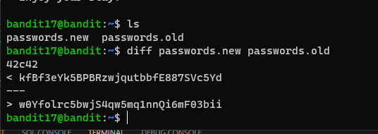

# 문제설명

Level Goal 
There are 2 files in the homedirectory: passwords.old and passwords.new. The password for the next level is in passwords.new and is the only line that has been changed between passwords.old and passwords.new 
 
NOTE: if you have solved this level and see ‘Byebye!’ when trying to log into bandit18, this is related to the next level, bandit19 
 
Commands you may need to solve this level 
cat, grep, ls, diff 
 

# 문제풀이

new file과 old file에서 하나의 라인이 다르다고 한다. 
그리고 다른 라인이 password이다.

 diff 라는 명령어를 사용했다. 

 diff 명령어(파일)는(은) 파일의 내용을 한줄한줄씩 읽어 다른 파일들과 비교를 해주는 프로그램입니다.   

이번 레벨은 쉬어가는 step?ㅎㅎㅎ

