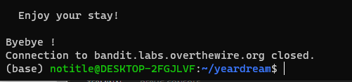
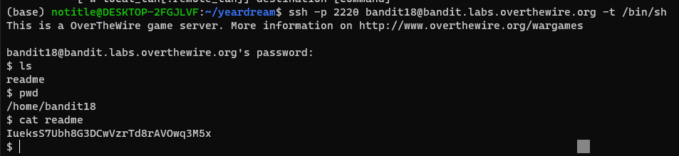
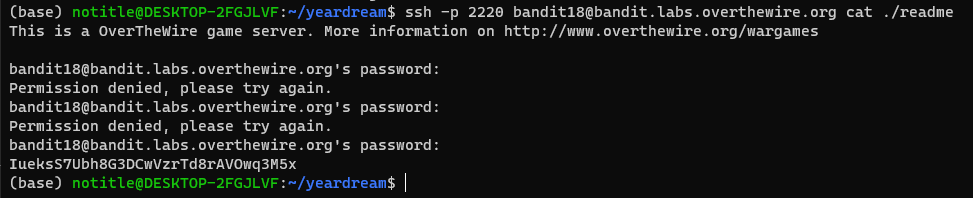

# 문제설명

Level Goal 
The password for the next level is stored in a file readme in the homedirectory. Unfortunately, someone has modified .bashrc to log you out when you log in with SSH. 
 
Commands you may need to solve this level 
ssh, ls, cat 
 

# 문제풀이

상당히 재미있다. 

 문제 설명에서와 같이 로그인을 하면 로그아웃이 되게 .bashrc file이 수정되어 있다. 

1번째 방법 
 ssh -t 옵션을 줘서 /bin/sh로 pseude terminal로 접속이 가능해졌다. 보면 pwd에서 bandit18로 접속한것을 확인할수있다.   

2번째방법
 ssh 설명란에는 맨 마지막에 명령어를 적는 방법이 있다고 나와있다.  그래서 기본 위치인 홈디렉토리에서 readme를 바로 읽게 했더니 문제를 해결할수 있었다.

