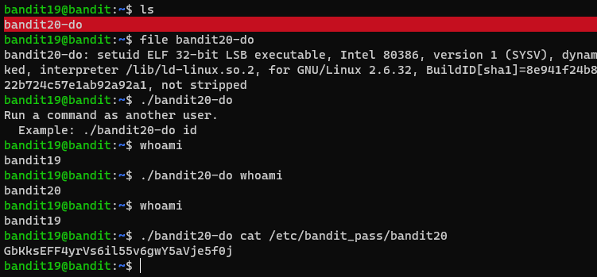
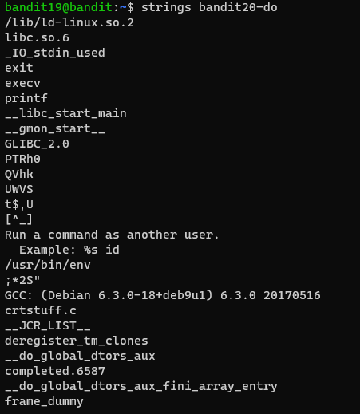

# 문제설명

Level Goal 
To gain access to the next level, you should use the setuid binary in the homedirectory. Execute it without arguments to find out how to use it. The password for this level can be found in the usual place (/etc/bandit_pass), after you have used the setuid binary. 

# 문제풀이

홈 디렉토리의 setuid를 사용해야 한다. 
setuid의 실행방법과 구글링을 하면 쉽게 풀릴수 있다.

 file 명령어 혹은 ls -al 명령어로 setuid file임을 확인할수 있다. 
이 파일을 실행하면 다른 유저로써 명령어를 실행합니다.

setuid비트가 설정되어 있기 때문에, sh 쉘 프로그램을 실행시키면 bandit20 유저로써 sh프로그램을 실행할 수 있습니다.    

