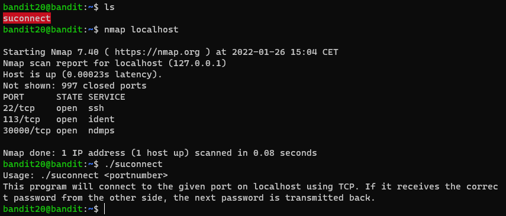
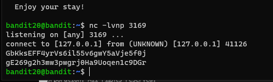
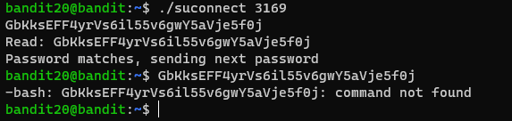

# 문제설명
<hr size=10 noshade>
Level Goal<br/>
There is a setuid binary in the homedirectory that does the following: it makes a connection to localhost on the port you specify as a commandline argument. It then reads a line of text from the connection and compares it to the password in the previous level (bandit20). If the password is correct, it will transmit the password for the next level (bandit21).<br/>
<br/>
NOTE: Try connecting to your own network daemon to see if it works as you think<br/>
<br/>
Commands you may need to solve this level<br/>
ssh, nc, cat, bash, screen, tmux, Unix ‘job control’ (bg, fg, jobs, &, CTRL-Z, …)<br/>
<br/>
<hr size=10 noshade>

# 문제풀이
이전 문제처럼 setuid 문제이지만, 인자값을 주고, 이전레벨의 비밀번호와 비교하는과정이 추가되었다.
단순히 옵션값 하나 추가되었다고 보면 된다.

<p><br/>일단 파일을 열어보니 사용법이 나와 있다.</p>

```
This program will connect to the given port on localhost using TCP. If it receives the correct password from the other side, the next password is transmitted back
```
```
이 프로그램은 로컬호스트의 포트로 TCP를 이용해 연결합니다. 연결이 되었을 경우, 비밀번호를 주면, 다음 비밀번호를 줍니다.
```

<p>터미널은 총 2개(공격자용 하나, 공격대상용 하나)실행시켜 주어 둘다 반딧에 접속합니다.<br/>
그리고 나서 한개의 터미널로 포트를 개방해 요청을 기다리고, 다른 터미널에서 동일한 포트로 요청을 보냅니다.<br/></p>

공격대상 터미널

공격자용 터미널



<p>공격대상 터미널에서 패스워드를 입력하고, <br/>공격자에서 패스워드를 입력하면<br/>next level의 password를 준다.<br/><br/></p>
<p></p>
