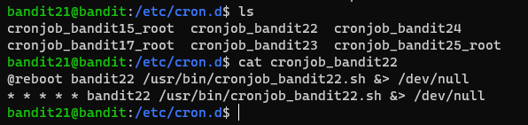
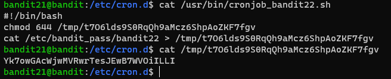

# 문제설명

Level Goal 
A program is running automatically at regular intervals from cron, the time-based job scheduler. Look in /etc/cron.d/ for the configuration and see what command is being executed. 
 
Commands you may need to solve this level 
cron, crontab, crontab(5) (use “man 5 crontab” to access this) 
 

# 문제풀이
/etc/cron.d/ 를 들여다보면 크론잡의 세팅값들을 확인해볼수 있습니다.

 세팅값이 * * * * * 으로 되어있다. 여기에 대한 설명은 밑에서 해주겠다.

 파일을 읽어보면 파일이 저장되는 위치가 나오게 되고, 저장되는 파일을 읽어보면 플래그를 구할수있따. 

 
크론/크론잡은 특정시간 마다 특정 잡을 자동으로 실행시켜주는 소프트웨어 유틸리티입니다. 
예를 특정시간마다 단체문자를 보낼수도있고, 용도는 다양합니다. 
크론잡들은 크론탭 파일을 통해 지정할 수 있습니다. 크론탭의 형식은 다음과 같습니다.

[분]&nbsp;&nbsp;[시간]&nbsp;&nbsp;[일]&nbsp;&nbsp;[월]&nbsp;&nbsp;[일주일중몇일]&nbsp;&nbsp;[실행명령어]

위와 같은 형식에서 * 의 의미는 매분,매시간,매일,매달,7일 이라는 의미를 뜻합니다.

/etc/* 에 있는 크론잡들은 시스템 전체에 영향을 미친다.
