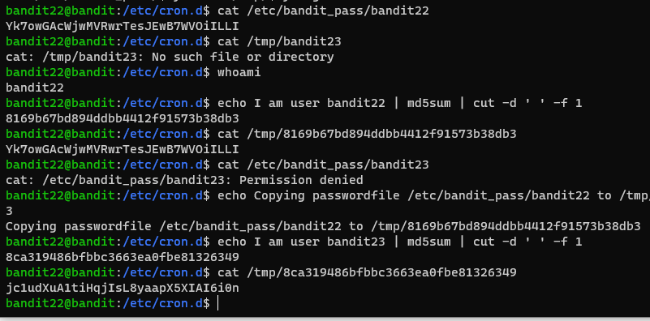

# 문제설명
<hr size=10 noshade>
Level Goal<br/>
A program is running automatically at regular intervals from cron, the time-based job scheduler. Look in /etc/cron.d/ for the configuration and see what command is being executed.<br/>
<br/>
Commands you may need to solve this level<br/>
cron, crontab, crontab(5) (use “man 5 crontab” to access this)<br/>
<br/>
<hr size=10 noshade>

# 문제풀이
/etc/cron.d/ 를 들여다보면 크론잡의 정보를 확인해볼수 있습니다.<br/>
이전 문제와 비슷한 유형이지만, 이문제는 쉘 스크립트 파일을 해석하는 문제입니다.<br/>어려운 개념은 아닙니다!!<br/><br/><br/>




<p><br/>

```
cat /usr/bin/cronjob_bandit23.sh
```
읽어보면, 스크립트 내용이 나오게 됩니다.
명령어들을 쭉 읽어보시면 아시겠지만, 저는 22level의 password도 확인해보았습니다.(처음에 보험삼아 해봤는데 되네요;;)<br/>
<br/><br/>
스크립트는 반딧유저의 비밀번호를 /tmp/$mytarget 파일에 저장하고 있으며,<br/>
md5sum이라는 인코더 혹은 암호화(?)로 변형해줍니다.

</p>