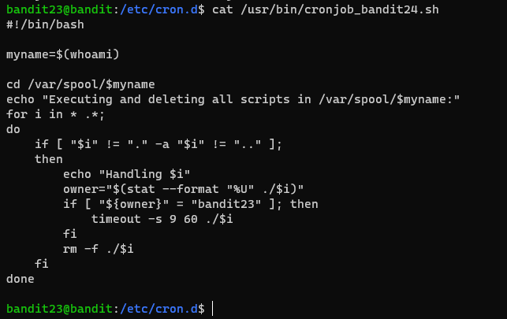

# 문제설명
<hr size=10 noshade>
Level Goal<br/>
A program is running automatically at regular intervals from cron, the time-based job scheduler. Look in /etc/cron.d/ for the configuration and see what command is being executed.<br/>
<br/>
NOTE: This level requires you to create your own first shell-script. This is a very big step and you should be proud of yourself when you beat this level!<br/>
<br/>
NOTE 2: Keep in mind that your shell script is removed once executed, so you may want to keep a copy around…<br/>
<br/>
Commands you may need to solve this level<br/>
cron, crontab, crontab(5) (use “man 5 crontab” to access this)<br/>
<br/>
<hr size=10 noshade>

# 문제풀이
cron에 의의해서 자동적으로 프로그램이 실행된다.<br/>
/etc/cron.d/에서 환경설정을 확인해 봐라.<br/>
쉘 스크립트를 작성해야 할거고, 삭제되니깐 유의하라고 한다.<br/>



<p><br/>
쉘 스크립트의 내용을 해석해보면,<br/>
</p>

```
var/spool/bandit24의 모든 파일들 중 bandit23의 스크립트들을 60초동안 실행한뒤, 강제종료후, 삭제한다.
```


<p><br/>
문제해결법으로 대다수의 사람들이 패스워드 복사를 선택한듯하다.<br/>

permission을 777로 주어 파일이 생성될수있게 해주어야 한다.
</p>

```
#!/bin/bash
cat /etc/bandit_pass/bandit24 > /tmp/notitle/password.txt
```

