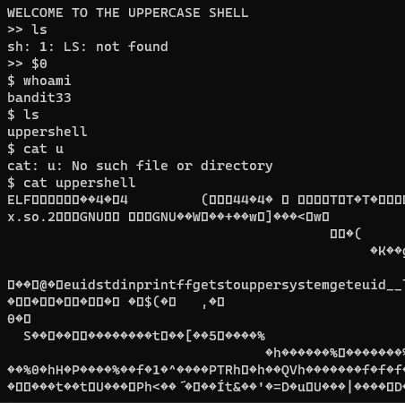

# 문제설명

Level Goal 
After all this git stuff its time for another escape. Good luck! 
 
Commands you may need to solve this level 
sh, man 
 

# 문제풀이
sh에 관한 문제가 출제되었다. 

 
보면 uppercase shell 이라고 합니다. 
통상적으로 linux에서 명령어를 내리면 해당하는 명령어를 쉘 스크립트가 실행(원래는 파일입니다.)해주는데, 이 쉘 스크립트는 upper case shell 이라고 하는것 같습니다. 
출력 형식이 upper caser로만 작동이 되네요!! 
잘은 모르지만, 구글링해본결과 sh이라는 쉘 스크립트에서 특정한 코드들이 작동하는것같다고 합니다. 
sh만 실행하게 하는방법이 필요하다고 하네요. 
보통의 쉘 스크립트는 sh 옵션 <어쩌고저쩌고> 라고 하는데, 
positional argumentdls $0을 사용한다면 sh만 실행된다고 합니다!! 

 
 
 

 
2022년 1월 29일을 기준으로 현재문제가 마지막 문제입니다. 
알고리즘문제, overthewire에 있는 다른 wargame, CTF, pytorch, data 등등 할게 많지만, 조급해하지 않고 차분히 해보겠습니다.!!  

bandit의 모든 문제를 다시 구글링해서 풀이를 추가해볼까? 하는 생각도 하고있습니다!!!

