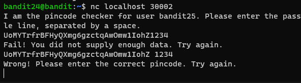
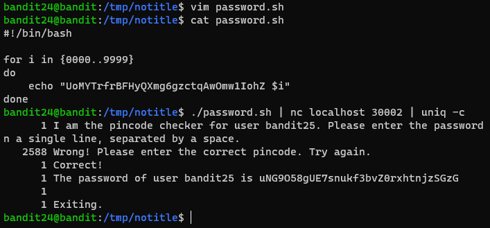

# 문제설명
<hr size=10 noshade>
Level Goal<br/>
A daemon is listening on port 30002 and will give you the password for bandit25 if given the password for bandit24 and a secret numeric 4-digit pincode.<br/>
 There is no way to retrieve the pincode except by going through all of the 10000 combinations, called brute-forcing.<br/>
<br/>
<hr size=10 noshade>

# 문제풀이
30002포트에서 대몬이 듣고있다고 합니다.<br/>
30002포트에 bandit24의 passowrd와 secret numeric 4-digit pincode를 입력하면 bandit25 password를 준다고 합니다.<br/>
10000가지의 combinations에 대하여 brute-forcing을 하는것외에는 pincode를 얻을수있는 방법이 없다고 하네요<br/>



```
bandit24-password<space>0000~9999
```

<p><br/>
password 스크립트 파일은 위와 같이 작성하였으며,<br/>
파이프라인으로 실행하고, uniq의 -c 명령어로 해결했다.<br/>
sort 명령은 따로 해주지 않아도 된다.!!!
</p>


```
UoMYTrfrBFHyQXmg6gzctqAwOmw1IohZ 2588
```
