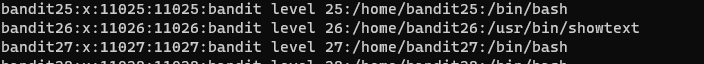
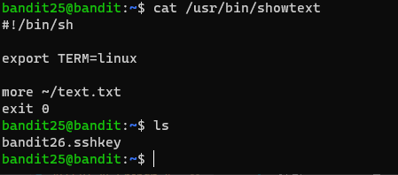
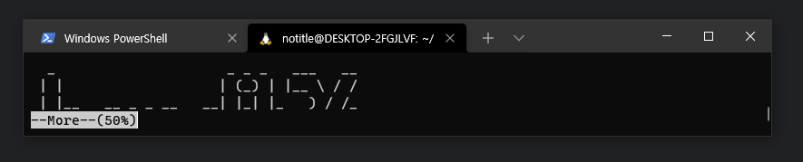
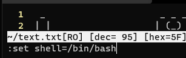
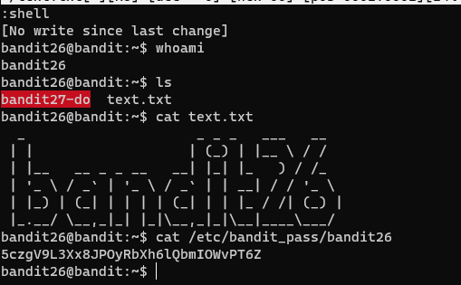

# 문제설명

Level Goal 
Logging in to bandit26 from bandit25 should be fairly easy… The shell for user bandit26 is not /bin/bash, but something else. Find out what it is, how it works and how to break out of it. 
 
Commands you may need to solve this level 
ssh, cat, more, vi, ls, id, pwd 
 

# 문제풀이
bandit26에 로그인하는것은 쉬운데 /bin/bash가 아니라고 합니다.
찾아서 무엇인지 해결하라고 하는데.. 

일단 bandit26은 /bin/bash가 아니라 다른거라고 하니 확인을 해봅시다.
 
 

위에서와 같이 /usr/bin/showtext이며, 스크립트의 내용은 
홈디렉토리에있는 text.txt를 실행하고 종료하게 되어있습니다. 

bandit25의 홈디렉토리에 있는 sshkey로 접속을 시도하면 아마 종료가 될것입니다. 

 
해결방법은 more명령어를 사용하는거라고 합니다. 

저렇게 터미널창을 축소시켜 bandit26에 key file을 주어 접속하면 more 명령어가 자동적으로 실행이 됩니다.!!!! 

    

# Reference

<ul>
<li><a href="https://gtfobins.github.io/gtfobins/vim/" target="_blank">https://gtfobins.github.io/gtfobins/vim/</a></li>
</ul>