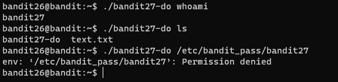
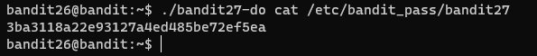

# 문제설명

Level Goal 
Good job getting a shell! Now hurry and grab the password for bandit27! 
 
Commands you may need to solve this level 
ls 
 

# 문제풀이
문제설명과 키워드 매우 심플하다 ㅋㅋㅋ
    

 
문제설명이 간단해서 기대했는데. permission denied라고 한다.  
  
생각해보니깐 실행시킬 필요가 없다.. 읽으면 된다 ㅋㅋㅋㅋㅋㅋ
  
되게 쉬운문제다 ㅎㅎ

