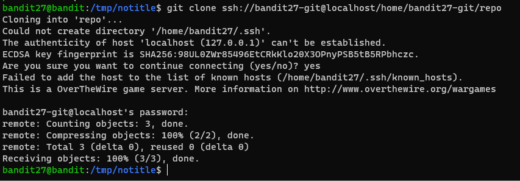
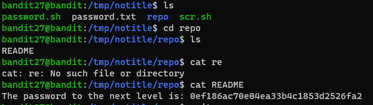

# 문제설명

Level Goal 
There is a git repository at ssh://bandit27-git@localhost/home/bandit27-git/repo. The password for the user bandit27-git is the same as for the user bandit27. 
 
Clone the repository and find the password for the next level. 
 
Commands you may need to solve this level 
git 
 

# 문제풀이
git repo를 clone해서 풀라는것 같은데, git은 프로젝트하면서, 그리고 지금도 많이 쓰고 있으니 일단 부딪혀본다  

git은 개발자라면 쓸수밖에 없습니다.  설명 생략합니다.    

 

