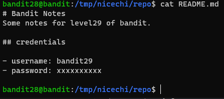
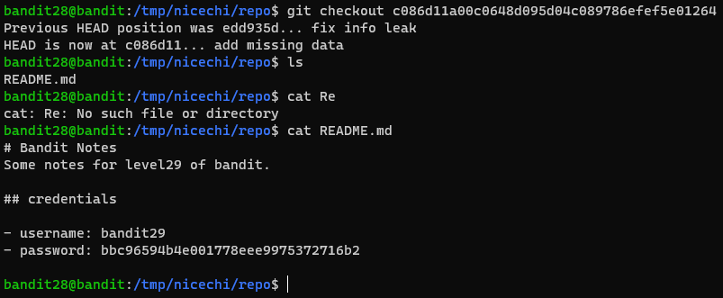

# 문제설명

Level Goal 
There is a git repository at ssh://bandit28-git@localhost/home/bandit28-git/repo. The password for the user bandit28-git is the same as for the user bandit28. 
 
Clone the repository and find the password for the next level. 
 
Commands you may need to solve this level 
git 
 

# 문제풀이

 
처음에는 이게 뭐라는 거지?? 
한참을 들여다봐도 모르겠다. 
hint로 주어진 keyword도 git 밖에 없었다. 
그러다가 가만히 보니깐 - 기호가 변경내역처럼 보였다.. 
  
이게 바로 git을 쓰는 이유지..  
확실한 버전관리 

