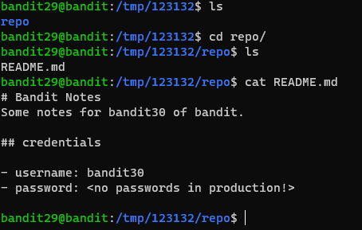
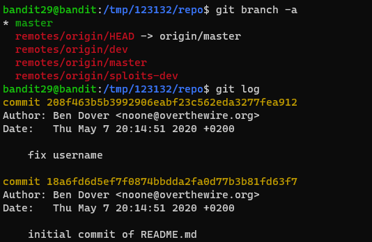
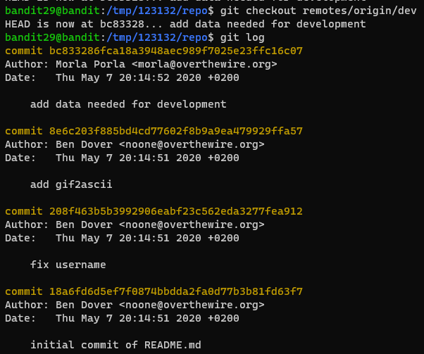
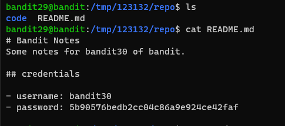

# 문제설명

Level Goal 
There is a git repository at ssh://bandit29-git@localhost/home/bandit29-git/repo.  The password for the user bandit29-git is the same as for the user bandit29. 
 
Clone the repository and find the password for the next level.  

Commands you may need to solve this level 
git 
 

# 문제풀이

 
git관련 문제로 바뀌면서 편안하다 ㅎㅎ

 
 일단 문제가 password를 알아내면 될것같다.

  
일단 branch를 /remotes/origin/dev로 변경을 해보았고, 
파일 목록을 출력해보니 code라는 폴더와 README.md 파일이 있었다. 
보시다 시피 dev라는 branch에서는 README.md에 password가 적혀있었다.!!! 

