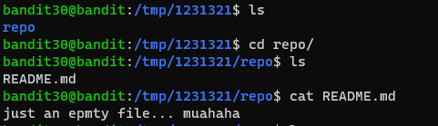
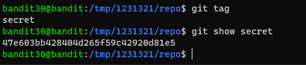

# 문제설명

Level Goal 
There is a git repository at ssh://bandit30-git@localhost/home/bandit30-git/repo.  The password for the user bandit30-git is the same as for the user bandit30. 

Clone the repository and find the password for the next level.  

Commands you may need to solve this level 
git 
 

# 문제풀이

 
음.. .일단 하던대로 branch 먼저 확인해봐야겠다. 
이미지가 너무 많아서 첨부하기는 그렇지만, branch를 변경하기 위해서 무수히 많은 시도를 해보았지만, 소용이 없었다. 
내가 모르는 git의 무언가가 있는것 같다. 
status, log, branch 이렇게 3가지가 안 먹힌다면, tag 명령어도 입력해보자. 
git에는 특정버전에 주석을 달아줄수가 있다. 그 기능을 tag가 해준다!! 
   
어떻게 보면 tag를 쓰라고 주었다. log도 1개뿐이고, branch변경도 안되고, status도 특별한게 없으니, tag를 써야 풀게 해두었다.

