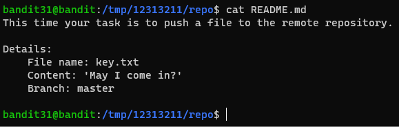
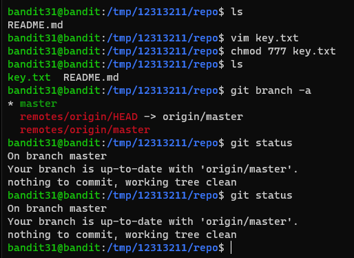
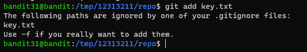
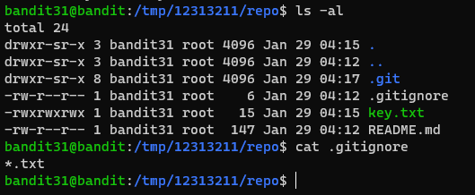
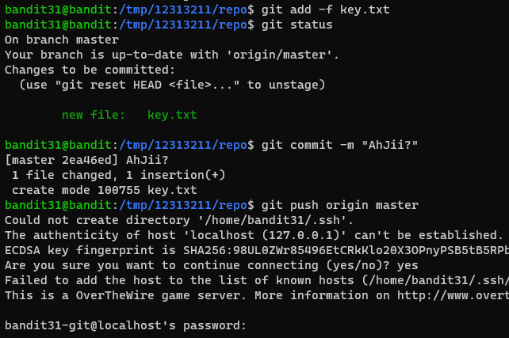
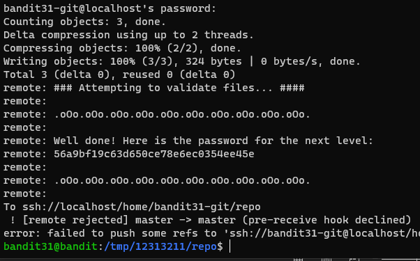

# 문제설명

Level Goal 
There is a git repository at ssh://bandit31-git@localhost/home/bandit31-git/repo.  The password for the user bandit31-git is the same as for the user bandit31. 
 
Clone the repository and find the password for the next level. 
 
Commands you may need to solve this level 
git 
 

# 문제풀이

 
문제설명이 README.md 파일에 적혀있습니다. 
master branch에 file name은 key.txt로 하고, file content는 May I come in?으로 해서 push하라고 하네요. 
하라는 대로 합시다!! 
 
음..status에 원래 add목록이 떠야 되는데 안뜬다.. 
현실을 부정했는지, 한번더 입력해보았다..ㅋㅋ 
 
아하... .gitignore라는게 있는데, 이것은 Project에 원하지 않는 Backup File이나 Log File , 혹은 컴파일 된 파일들을 Git에서 제외시킬수 있는 설정 File이다. 
그러면 ignore파일은 수정하던지, -f 옵션을 주어서 하면 된다. 
-f 옵션을 주어서 해보겠습니다.
 
 
 
이미지가 너무 많아졌네;;

