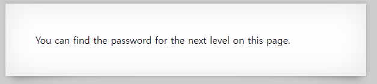
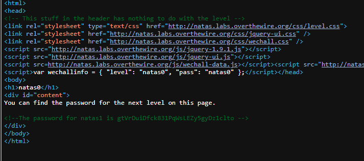

# 문제설명

Username: natas0 
Password: natas0 
URL: &nbsp;&nbsp;&nbsp;&nbsp;&nbsp;&nbsp;
<a href="http://natas0.natas.labs.overthewire.org" target="_blank">
http://natas0.natas.labs.overthewire.org</a>
 

# 문제풀이
문제설명이 굉장히 짧다. 
try의 난이도인것 같다. 

  
홈페이지에서 찾으면 된다고 하는데...뭐를 어떻게..? 
험난한 길이 예상되고, 구글링에 모든걸 맡겨야 하는구나. OSINT 문제였었나?ㅋㅋ 

  
The password for natas1 is {}부분이 flag이다!!! 
알아낸 방법은 
홈페이지에서 마우스 우측버튼 클릭 후, 소스보기를 하면 위와같은 이미지가 나오고, 
아니면 F12버튼을 누르면 창이 나오는데, 거기서 소스(Source)를 클릭하게 되면 확인해 볼수있다!!! 
주석으로 flag를 알려주고 있다. 

