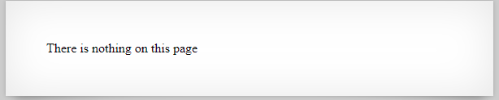
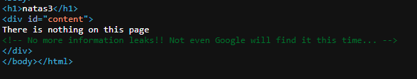
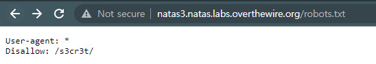
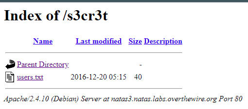
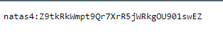

# 문제설명

Username: natas3 
URL: &nbsp;&nbsp;&nbsp;&nbsp;&nbsp;&nbsp;
<a href="http://natas3.natas.labs.overthewire.org" target="_blank">
http://natas3.natas.labs.overthewire.org</a>
 

# 문제풀이
  
  
아쉽네요 더 이상의 소스보기로는 힌트가 없나보네요ㅜ 그래도 매번 확인은 꼼꼼히 해야합니다. 
  
웹사이트를 해킹할때 저의 짧은지식으로는 2가지를 늘 확인합니다. 
하나가 Source, 하나가 robots.txt 이것말고도 명령어가 많은데, 하나하나씩 배워보겠습니다.  

  
  
natas4의 flag를 획득할 수 있었습니다.

  
robots.txt 는 항상 루트 디렉토리에 위치해 있어야 합니다. 
법은 아니지만 관행(?)입니다.
 

# Reference
<ul>
<li>
<a href="https://searchadvisor.naver.com/guide/seo-basic-robots" target="_blank">
https://searchadvisor.naver.com/guide/seo-basic-robots</a></li>
</ul>

