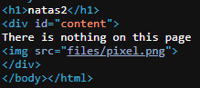
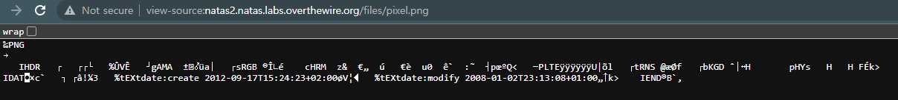
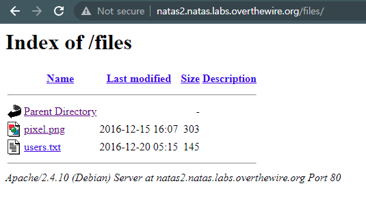
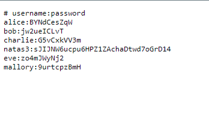

# 문제설명

Username: natas2 
URL: &nbsp;&nbsp;&nbsp;&nbsp;&nbsp;&nbsp;
<a href="http://natas2.natas.labs.overthewire.org" target="_blank">
http://natas2.natas.labs.overthewire.org</a>
 

# 문제풀이
  
  
확인해보니 flag는 안보이고 image file만 보이는데 저게 상당히 의심이 갑니다.  
  
url을 입력하고 접속해보니 괴상한게 나옵니다. 
경로를 소스보기 경로가 아닌 일반접속(?)으로 바꾸어서 files에 들어가보았습니다. 
  
  
natas3의 flag를 획득할 수 있었습니다.

  
제가 자세히 기억이 안나는데 CTF참여시에 web site의 모든 경로들을 나타내주는 명령어가 있었는데, 그 명령어를 썻어도 해결할 수 있는 문제였겠네요. 
kali에서 한번 사용해봤지만, 기록을 안해놔서 그런지.. 어떤건지 모르겠네요 ㅠㅠ 
아시는 분은 댓글 부탁드려요. 

ex) {무슨 명령어} www.naver.com 
하게 되면, 

www.naver.com/a/...(그외 하위경로들) 
www.naver.com/b/...(그외 하위경로들) 
www.naver.com/c/...(그외 하위경로들) 
 
이런식으로 보여주는게 있었는데 ㅠㅠ 

