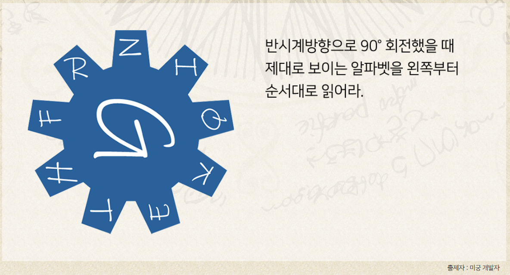

# 잡담   
이 문제는 내가 멍청해서 오래걸렸다.... 
하..ㅋㅋ 어이가 없는데, 웃기다 ㅋㅋ 
이 문제로 하루종일 고민해서 못풀고, 14일 뒤에야 다시보는데 풀렸다 ㅋㅋㅋ  

# 2020[허풍의퍼즐 세계일주] 8A.자물쇠를 열어 성으로 들어가라

# 문제풀이
정말 간단한 문제인데 이걸 하루종일 고민해서도 뭇 풀었다.. 
문제를 바로 풀어보면, NITHG라는 알파벳5개가 나온다. 
문제에서는 왼쪽부터 읽으라고 했다. 
이 왼쪽이라는게 수평선으로 보면 이해하기가 쉬워질것이다. 
톱니바퀴의 튀어나온부분으로 한칸한칸씩 가지말고, 수평선으로 접근하면 된다. 
근데 나는 도저히 모르겠어서, 나오는 영어단어가 뭐가 있는지 조합을 인터넷으로 알아냈다. 부끄럽지만 NITHG를 보고 NIGHT를 유추해내지 못했다.ㅋㅋㅋ 
 
 
 

정답은 <strong>NIGHT</strong>이다.
   

# Reference
<ul>
<li><a href="http://wordfind.co.kr/Search.asp?keyword=nigth" target="_blank">http://wordfind.co.kr/Search.asp?keyword=nigth</a></li>
</ul>