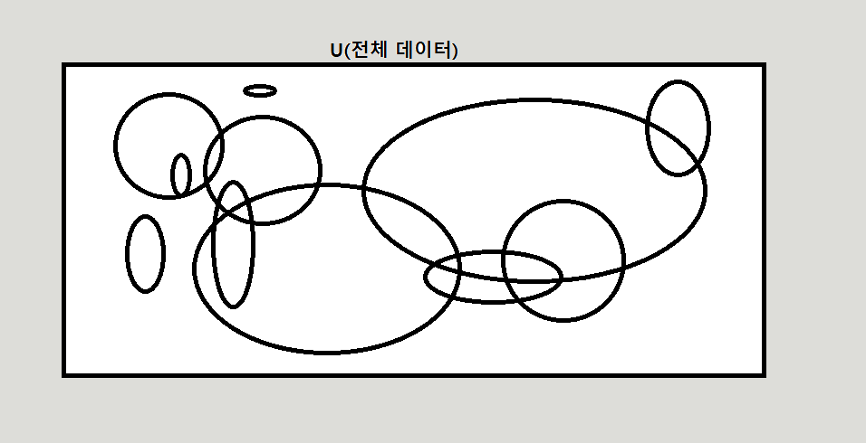

# &nbsp;&nbsp;&nbsp;&nbsp;Ah-Jji?

## 먼저, Data는 무엇이며, 어떻게 만들어지나요?

먼저 데이터는 어떻게 만들어 질까요? 
저는 <strong>인간에 의해서 만들어진다고 생각</strong>합니다. 
조금 더 좁은 의미로 보저면, <strong>인간의 필요에 의해서 만들어진다고도 생각</strong>할 수 있는데요. 
 
음... 데이터라는거는 저희가 그렇게 부르기 때문입니다. 
당연한 얘기이지만, 데이터를 데이터라고 부릅니다. 
그런 의미에서 인간을 데이터라도 부를 수 있고, 인간이라고도 부를 수 있습니다. 
물고기를 물고기라고도 부를 수 있지만, 데이터라고도 부를 수 있습니다. 
즉, 존재하건 존재하지 않건, <strong>어떤 개념(관념)만 있다면, 데이터</strong>라고 부를 수 있고, 사용할 수도 있습니다. 
 
그러면 다음 주제로 넘어가 보겠습니다.

  

## 데이터를 어떻게 바라보아야하는가.

  
현실세계에 존재하는 데이터<strong>(전체집합)</strong>에는 정말 다양한 데이터<strong>(부분집합)</strong>들이 존재합니다. 
이런 데이터들 중에서는 서로 겹치기도 하고, 어떤 데이터의 부분집합이기도 하고, 독립적인 데이터들도 있습니다. 
(전체 데이터 안에는 이미지,자연어,시계열 등등의 데이터들이 존재합니다.)  
  
Machine Learning Competition을 참가해보면서, <strong> `데이터에 대한 접근방법이 다양하지는 않구나` </strong>라는 생각을 하게 되었습니다. 
 

이미지, 자연어, 시계열 3가지 대회를 참가했습니다. 
Image Competition에서는 제일 중요한게 이미지를 이해(학습)하는 것입니다. 
간략히 설명드리자면, 
사람은 어떤 이미지를 보고 사람인지, 동물인지, 식물인지를 직관으로써 유추해 내는데요.  
컴퓨터에게 이미지라는 의미는 그냥 RGB값(숫자)입니다.  
그렇다면 컴퓨터에게 어떻게하면 사람인지, 동물인지, 식물인지를 이해시킬수가 있을까요.  
그게 저희가 해결해야하는 문제입니다  
  
방법론들은 여러가지가 있지만, 결국은 주어진 이미지들을 학습하는게 목표입니다.  
  
자연어 Competition도 마찬가지입니다.  
한글인지, 영어인지, 스페인어인지 먼저 타겟언어를 정하고,  
한국어라면, 댓글(인터넷 블로그, 커뮤니티 글 등등)인지, 신문 또는 책에서 나온 글인지에 따라서 학습시키는 유형이 또 달라집니다.  
하지만 자연어 분야도 마찬가지로 언어를 학습(이해)하는게 중요합니다.    

결국은 우수한 모델이라고 하는것은, 특정 데이터를 학습시키고, 특정 Task를 우수한 성능으로 해결해내는것을 말하는 것인데, 
여기서 궁금한점이 하나 있습니다.  

<strong>모델이 어떤걸 기준으로 잡고 학습을 해야하나요?</strong>  
(혹시 label이라고 답변하셨다면, 정말 열심히 공부하신겁니다.) 
 
음...자연어 모델을 만들고 단어의 뜻을 유추하는 문제를 해결해본다고 가정해 보겠습니다. 
`깞캋룮` 이라는 한글단어가 있는데요.  
이 단어의 의미를 아시는 분이 계신가요? 위의 단어는 아무런 뜻도 없습니다. 
 
어?..저는 어떻게 아무런 뜻도 없다는것을 알았죠? 
혹시, 여러분도 아무런 뜻이 없다는것을 알았나요? 
사실 저희가 말하는 모델의 정확도 또는 우수함이라는것은 인간 기준입니다. 
왜 인간기준일까요? 
모델이 모든 한글데이터들을 다 학습한후에 위의 단어의 뜻을 정의내릴수도 있지않을까요? 
정의내리면 안되는건가요? 
 
`모델이 어떤걸 기준으로 잡고 학습을 해야하나요?`라는 질문에 label이라고 답변하셨다면, 그 label 또한 인간이 결정한거 아닌가요? 
label이 있는 데이터들에 대해서 학습을 시키고, 모델에게 문제를 해결하라고 명령하면, 결국 인간의 생각범위 안에있는 정답만을 보여주는게 아닐까요? 

이 부분에서는 저는 제가 맨 처음에 언급한 데이터의 개념에 대해 다시 설명해 드릴려고 합니다. 
 
데이터란 인간의 의해 만들어졌습니다. 
그러한 데이터로 학습하는 모델 또한 인간의 영향을 받았으며, 
결국은 단순반복작업 밖에 하지 못하는 프로그램에 불과하다고 생각됩니다. 
 
제가 생각하고 있는 인공지능은 이런게 아닌데 말이죠.. 
제가 3개월전에 인공지능과 데이터를 처음 공부하기 시작하면서 저는 정말로 영화에 나오는 인공지능과 로봇들을 생각했습니다. 
 
3개월이 지난 지금은 이런 생각을 합니다. 
과연 내가 죽기전에 그런 인공지능이 나타날까? 
<strong>데이터가 문제인가요? 모델이 문제인가요? 아니면 인간의 접근방법이 문제인가요?</strong> 
 

## 마무리

사실 그냥 모르겠습니다. 
네트워크, 시스템, 데이터 해야할 공부도 많고, 해보고 싶은것도 많습니다. 
일단 뭐라도 해보겠습니다. 
혹시 또 모르죠, 하다보면 뭐라도 보일지....(보였으면 좋겠네요) 

     

## 낙서(잡소리 및 의식의 흐름)

 
<del>
이게 어떻게 보면 당연하다고 생각은 되는데요 

<strong>이미지 데이터로 학습한 모델을 가지고서, 자연어 문제를 해결할 수 있을까요?</strong> 
  
된다면 왜 되는거고, 안된다면 왜 안되는걸까요?  
만약 된다고 생각하시는 분들이 계신다면, 이미지와 자연어의 데이터의 교집합이 어느정도 영역을 차지하고 있다고 생각하실수도 있으실겁니다.  
그리고, 안된다고 생각하시는분들은 이미지와 자연어의 데이터의 교집합이 없다라고 생각하시기 때문일겁니다.   
  
이게 사실 터무니없는 말이기도 합니다.  
당연하게도 이미지 데이터의 특성과 자연어 데이터의 특성이 다르기에, 이미지 데이터로 학습시킨 모델로는 자연어 문제를 해결하는것이 어렵습니다.    

지금 제가 하는말은 위에 있는 밴다이어그램에서 전체집합안에 있는 부분집합 1개가 과연 전체집합을 대표할 수 있는가?에 대한 고민을 해보자는 것입니다.  

모뎅이 
예측한 정답은 인간의 정답과 같아야 한다.
</del>